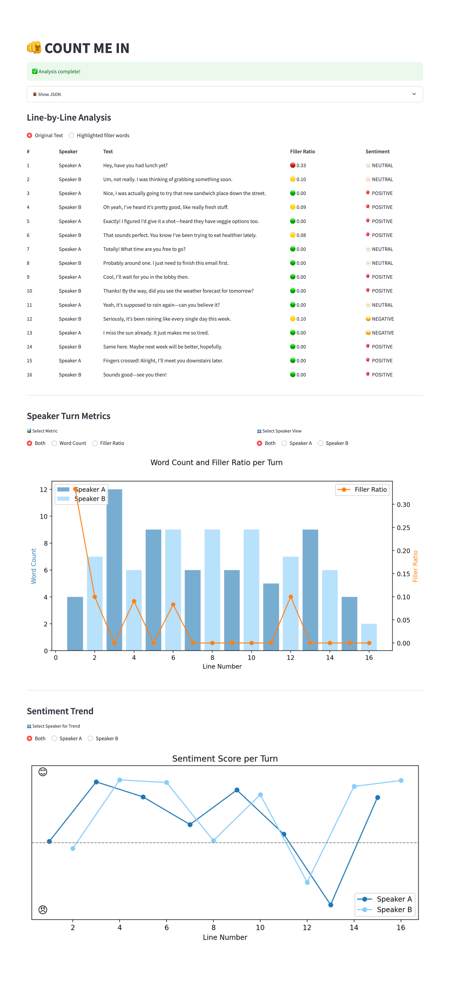

# Technical Assessment

## Overview
This project is a self-contained Python application for analyzing everyday dialogues. Given a conversational transcript (with at least 12–16 alternating lines and filler words), the app provides:

- Per-turn sentiment analysis using Hugging Face Transformers.
- Filler-word ratio computation (using spaCy or regular expressions).
- Interactive report dashboard built with Streamlit.
- Optional creative metrics (e.g., speaker word count trend).

Live preview: http://3.107.93.116:8501/


## Project Structure
```bash
├── analysis.py        # Functions: load_transcript, compute_sentiment, compute_filler_ratio, etc.
├── app.py             # Streamlit UI
├── transcript.txt     # Example dialogue transcript
├── requirements.txt   # Python dependencies
├── Dockerfile         # Containerization setup
└── README.md          # Documentation
```


## Metrics Description

### Metric1: Line-by-Line Analysis
- Sentiment: Classifies each turn as positive, negative, or neutral using Hugging Face’s sentiment-analysis pipeline.
- Filler-word ratio: Calculates the proportion of filler words (e.g., “um,” “like,” “you know”) to total words in each turn. Filler words are highlighted for easy review.

### Metric2: Speaker Turn Metrics
- Word count: Tracks the number of words per speaker.
- Filler ratio by speaker: Summarizes each speaker’s average use of filler words.
- Trend plots: View the metrics over time or by individual speaker.

### Metric3: Sentiment Trend
- Trendline: Visualizes sentiment polarity throughout the conversation, with options to filter by speaker.




## Quick Start

### Local Installation
```bash
git clone https://github.com/AndrewDuan64/bhw.git
cd bhw
pip install -r requirements.txt
python -m spacy download en_core_web_sm
streamlit run app.py
```

### Docker Installation(**Recommend**)
```bash
git clone https://github.com/AndrewDuan64/bhw.git
cd bhw
docker build -t bhw .
docker run -p 8501:8501 bhw
# Visit http://127.0.0.1:8501 (first run may be slow while models download)

```

### Deploying on AWS EC2 (t2.micro, Ubuntu, 30G)

- The t2.micro instance type is eligible for AWS Free Tier. Using AWS Free Tier resources does not violate any challenge rules, as no paid or proprietary services are required for this project.
- The first time you run the application, model downloads may take a few minutes. All instructions are based on free, open-source tooling.
- This demo is running on t2.micro: http://3.107.93.116:8501/

```bash
# This program requires more memory than provided by default on t2.micro. Creating a 4GB swap file is essential to successfully load language models and run analyses without errors.

sudo dd if=/dev/zero of=/swapfile count=4096 bs=1M
sudo chmod 600 /swapfile
sudo mkswap /swapfile
sudo swapon /swapfile
sudo swapon --show

sudo apt update
sudo apt upgrade -y

wget https://repo.anaconda.com/archive/Anaconda3-2024.02-1-Linux-x86_64.sh -O anaconda.sh
bash anaconda.sh
source ~/.bashrc

sudo sysctl -n -w fs.inotify.max_user_watches=524288

conda create -n bhw-env python=3.10 -y
conda activate bhw-env

git clone git@github.com:AndrewDuan64/bhw.git
cd bhw
pip install -r requirements.txt
python -m spacy download en_core_web_sm

nohup streamlit run app.py &
```


## “If I Had One Extra Hour...”

- **I would start by writing an automated testing script to lay the groundwork for future feature enhancements.** In the age of AI-driven rapid development, robust testing becomes even more crucial, just like improving the braking system when upgrading a car’s horsepower.
- **Second, I’d consult stakeholders to better understand the target use cases.** Delivering real-world solutions is at the heart of my technical philosophy.
- **For a wider users** (if this becomes an internet product), I would:
  - Expand support for longer and more flexible transcript formats.
  - Add speaker personality analysis (e.g., verbose vs. concise, patient vs. impatient) to make the app more engaging.
  - Explore emotion influence analysis (e.g., who drives the tone of the conversation) for use as a communication training tool.